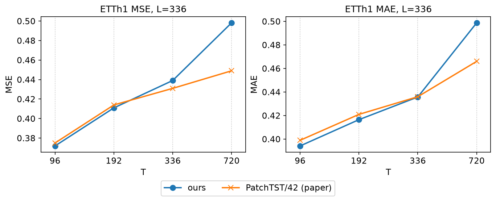
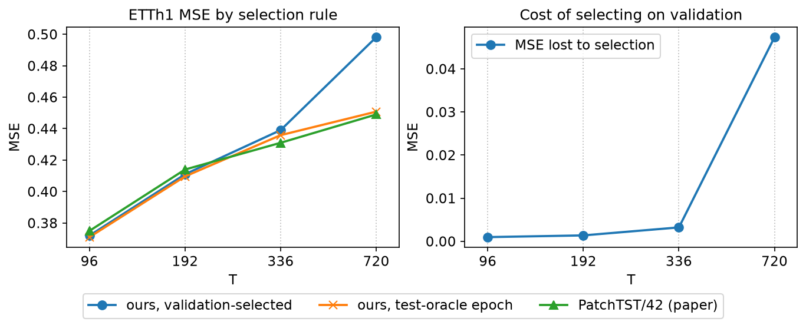

# PatchTST — a from-scratch replication

**Jiaxin (Olivia) Shen** · Ph.D. researcher, UVA Center for Diabetes Technology

A from-scratch reimplementation of:

> Nie, Y., Nguyen, N. H., Sinthong, P. & Kalagnanam, J. (2023).
> *A Time Series is Worth 64 Words: Long-term Forecasting with Transformers.*
> ICLR 2023. arXiv:2211.14730
> Official code: <https://github.com/yuqinie98/PatchTST>

The idea in one line: **stop feeding Transformers one timestep at a time.**
Group timesteps into *patches* and treat each patch as a token — like words
instead of characters. Then forecast every channel **independently** through one
shared backbone.

```
series      x_1 x_2 x_3 x_4 x_5 x_6 x_7 x_8 ...     (L timesteps, C channels)
                       |
   patching            v      P=4, S=2
patches     [x1..x4] [x3..x6] [x5..x8] ...           (N tokens per channel)
                       |
   channel-independent v      one shared Transformer, C series in parallel
encoder     h_1 h_2 h_3 ...
                       |
   flatten + linear    v
forecast    y_1 ... y_H
```

Two consequences that make the paper work:

1. **Attention is O(N²).** Patching cuts the token count from `L` to about
   `(L−P)/S + 2`, so the cost drops *quadratically*. That is what lets PatchTST
   afford a long lookback window when other Transformers cannot.
2. **A patch carries local semantics.** One timestep alone means very little;
   a 40-minute window has shape. This is the "64 words" in the title.

## Why I built this

I am replicating it because PatchTST is both the **backbone** and the **baseline**
in a CGM (continuous glucose monitoring) forecasting project I work on. Rather
than import it as a black box, I wanted to derive every piece from the paper.

This repo is a learning record, built step by step. The commit history is the
point — see [tutorial/](tutorial/).

## Relationship to the official code

The official implementation is <https://github.com/yuqinie98/PatchTST>
(Apache-2.0). **No code from it is copied into this repository.** I used the
paper as the specification and the official repo only as an answer key to check
myself against after each step. See [NOTICE.md](NOTICE.md) for attribution.

## Roadmap

| Step | Module | Paper anchor | What gets built |
|------|--------|--------------|-----------------|
| 1 | `data.py` | §5.1, Table 8 | ETTh1 loading, the 12/4/4-month split, train-only scaling, sliding windows |
| 2 | `revin.py` | §4.2, Kim et al. 2022 | Reversible instance normalization |
| 3 | `patching.py` | **§4.1, Fig 2** | The patching operation — the core contribution |
| 4 | `encoder.py` | §4.1 | Positional encoding + vanilla Transformer encoder |
| 5 | `backbone.py` | **§4.2** | Channel independence: `[B,T,C] → [B·C,N,P]` |
| 6 | `head.py` | §4.1 | Flatten + linear prediction head |
| 7 | `model.py` | Fig 1 | Assemble the full model |
| 8 | `train.py` | §5.2 | Training loop, MSE/MAE, early stopping |
| 9 | `experiments/` | **Table 3** | Reproduce ETTh1 at horizons 96/192/336/720 |
| 10 | `experiments/` | **Tables 6–7** | Channel-independence on/off, RevIN on/off, lookback sweep |
| 11 | `patchtst/cgm.py` | — | Apply the finished model to CGM forecasting |
| 12 | `patchtst/pretrain.py` | **§4.2, Table 12** | Masked self-supervised pretraining, linear probing, fine-tuning |

**Status: all twelve steps complete.** Every number is
in [RESULTS.md](RESULTS.md); each step is written up in
[tutorial/](tutorial/) ([9](tutorial/STEP09_reproduce.md) ·
[10](tutorial/STEP10_ablations.md) · [11](tutorial/STEP11_cgm.md) ·
[12](tutorial/STEP12_pretrain.md)).

### Results at a glance



Three horizons land on the paper. H=720 misses by +0.049 — and +0.047 of that
turns out to be *which epoch validation kept*, not how the model was trained:



All seven figures, with the tables they come from, are in
[RESULTS.md](RESULTS.md); `python experiments/figures.py` redraws every one of
them from the committed result JSONs. The plotting follows the paper's own
conventions — Figure 2's style for the metric panels, and the official repo's
six-line `visual()` for the forecast panels.

Four findings, none of them a clean win:

- **Step 9 — ETTh1.** Three of four horizons land within 0.01 MSE of the paper
  (96 and 192 slightly below it). H=720 misses by +0.049 — traced to checkpoint
  selection, not the implementation: 0.047 of that gap is validation stopping at
  epoch 2 while test error keeps falling to epoch 10.
- **Step 10 — ablations.** RevIN reproduces. The lookback claim reproduces in
  *direction* but not monotonically — it flattens past L=336. Channel
  independence does **not** reproduce Table 7 here: mixing ties at short
  horizons and wins at long ones.
- **Step 11 — CGM.** Channel mixing beats independence when `meal`/`bolus`
  causally drive `cgm` — but it also wins in the zeroed-driver control, and it
  carries 4.4% more parameters. Most of the apparent gain is capacity, not
  causal information.
- **Step 12 — self-supervised pretraining.** Selecting checkpoints on
  validation, masked pretraining appears to beat training from scratch at three
  of four horizons. Hold the selection rule fixed and it beats it at none. One
  arm lost 0.219 MSE to checkpoint selection alone — validation kept epoch 13
  where test's best was epoch 2 — and that single error produced the entire
  apparent win. ETTh1's validation split disagrees with its test split, worse as
  the horizon grows.

Everything here is a **single seed**. Differences under ~0.01 MSE are not
separable from seed noise and should not be read as wins.

The repo also records the mistakes: four bugs in my own test and collation code
that would each have shipped a plausible wrong number, written up where they
happened rather than quietly fixed.

## Data

`ETTh1` (Electricity Transformer Temperature, hourly) — 17,420 rows, 7 channels,
the standard long-term-forecasting benchmark. It is public, from
[zhouhaoyi/ETDataset](https://github.com/zhouhaoyi/ETDataset).

```bash
python scripts/download_data.py     # fetches data/ETTh1.csv
```

No patient data appears anywhere in this repository.

## Setup

```bash
python3.11 -m venv ~/venvs/patchtst-env
source ~/venvs/patchtst-env/bin/activate
pip install -r requirements.txt
```

## License

My code is [MIT](LICENSE). The original PatchTST is Apache-2.0 and is neither
included nor modified here; see [NOTICE.md](NOTICE.md).
