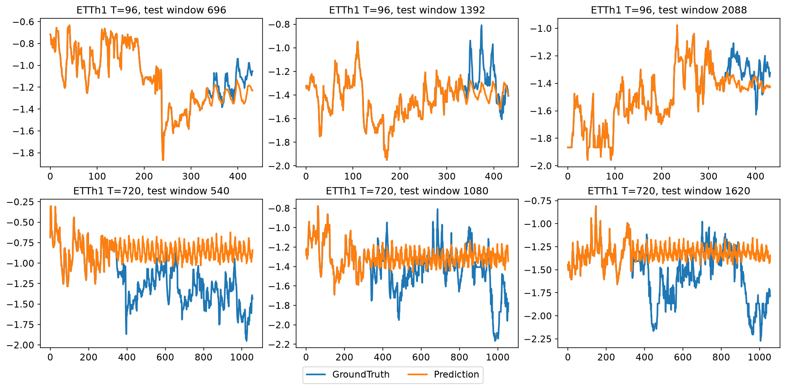
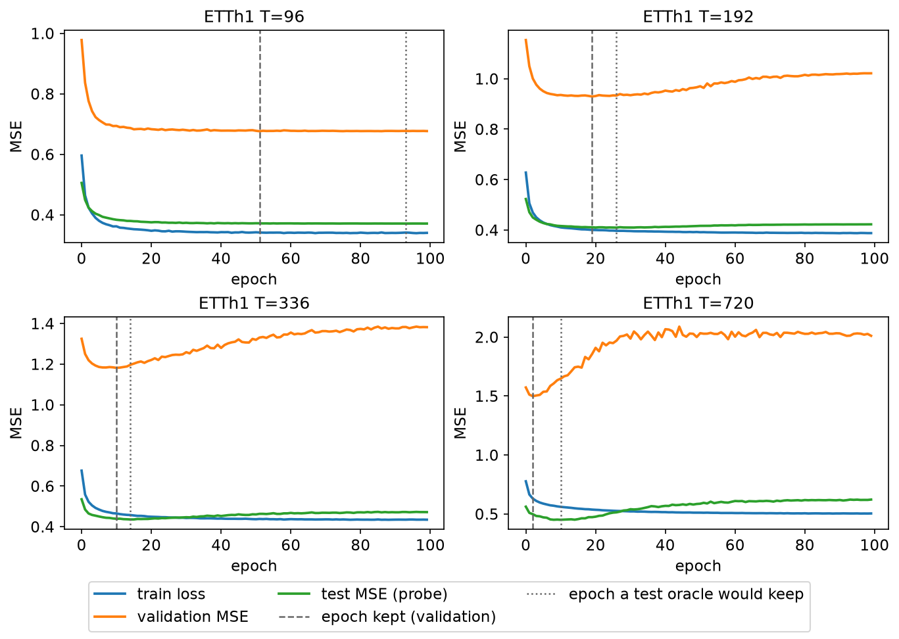
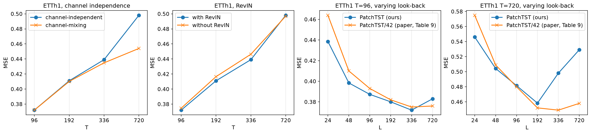
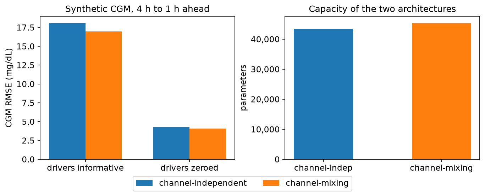
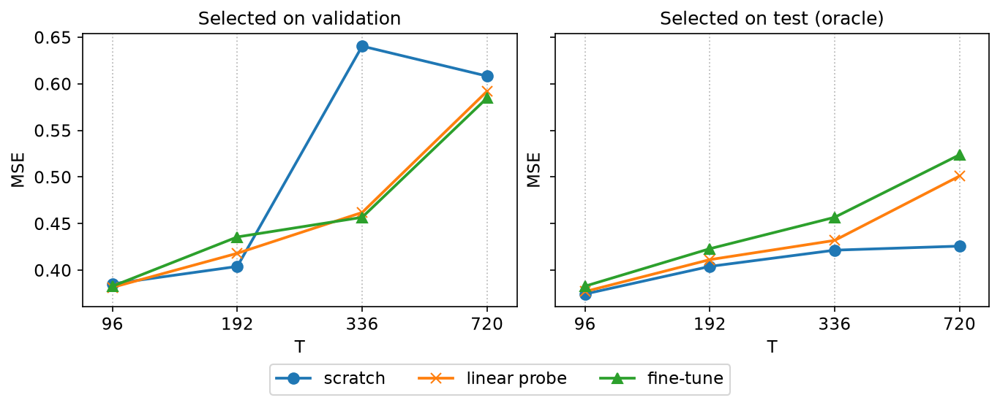

# Results

Every figure below is regenerated from the committed result JSONs by
`python experiments/figures.py` — nothing is drawn by hand, so a plot cannot
drift away from the table above it. The one exception is the forecast figure,
which loads the saved checkpoints; those are `.pt` files and too large to
track, so redrawing that one means training the runs first.

**The plotting follows the paper, not my taste.** The metric figures use the
conventions of the paper's Figure 2 (`pic/varying_L.png` in the official repo):
matplotlib defaults, a marker shape per series, dotted x-gridlines, one legend
below. The forecast figure reproduces `visual()` from
`PatchTST_supervised/utils/tools.py` exactly — the whole of the official repo's
plotting code, six lines of it.

**Reading convention.** Any series labelled *oracle* selects its epoch on the
**test** split. Those are diagnostics, never results.

## ETTh1, multivariate, lookback L=336 (PatchTST/42)

First reproduction run. SLURM array on one A40 per horizon, ~2 minutes each.
Commit `1ae39ed`, seed 2021, single seed per horizon.

| H | ours MSE | paper MSE | Δ | ours MAE | paper MAE | Δ | best epoch |
|---:|---:|---:|---:|---:|---:|---:|---:|
| 96 | **0.3720** | 0.375 | **−0.0030** | **0.3942** | 0.399 | **−0.0048** | 51 |
| 192 | **0.4110** | 0.414 | **−0.0030** | **0.4165** | 0.421 | **−0.0045** | 19 |
| 336 | 0.4391 | 0.431 | +0.0081 | 0.4358 | 0.436 | −0.0002 | 10 |
| 720 | 0.4981 | 0.449 | +0.0491 | 0.4987 | 0.466 | +0.0327 | 2 |
| | | | **+0.0128** | | | **+0.0058** | |

Reference values are PatchTST/42 from Table 3 of the paper. **/42, not /64** —
our L=336 with P=16, S=8 gives 42 patches; PatchTST/64 uses L=512 and is stronger
at every horizon, so comparing against it would be wrong.


Three of four horizons reproduce within 0.01 MSE, and 96/192 come in slightly
*below* the published values. H=720 is off by +0.049.

What that looks like as an actual forecast, drawn the way the official repo
draws it — `visual()` concatenates the lookback onto the front of both series
and plots the last channel, which is why the two lines coincide on the left of
every panel. Top row is the H=96 model, bottom row H=720, both at their
best-validation weights:



The bottom row is worth staring at. The H=720 model emits an almost flat
oscillation around a constant level: it has learned the mean and the daily
period and nothing else. That is what a checkpoint from **epoch 2** looks like,
and the next two sections are about why validation stopped there.

## Why H=720 misses

Not a generic "hyperparameter" shrug — the validation curves say exactly what
happens. Training loss falls monotonically at every horizon, while validation MSE
turns upward earlier and earlier:

| H | val start | val min | val @ep99 | best epoch |
|---:|---:|---:|---:|---:|
| 96 | 0.978 | 0.677 | 0.677 | 51 |
| 192 | 1.153 | 0.931 (ep 20) | 1.022 | 19 |
| 336 | 1.325 | 1.182 (ep 10) | 1.382 | 10 |
| 720 | 1.573 | 1.499 (ep 2) | **2.031** | 2 |



That is overfitting, and it scales with the horizon for a structural reason: the
flatten head is `n_patches × d_model → pred_len`, so its parameters grow linearly
with the horizon while the number of training windows *shrinks* (a longer horizon
consumes more of each split).

| H | head params | train windows | ratio |
|---:|---:|---:|---:|
| 96 | 81,742 | 8209 | ~10 |
| 720 | 501,694 | 7585 | ~66 |

## Two hypotheses tested, both falsified

Recorded because negative results are results, and because the second one only
looked plausible until it was run.

### Hypothesis 1 — the learning-rate schedule. REJECTED.

The official ETTh1 script uses `lradj type3` (constant for 3 epochs, then ×0.9
per epoch → ~0.18× by epoch 20, ~0.013× by epoch 50). Cosine over `T_max=100` is
nearly flat early (~0.91× at epoch 20). The prediction was that type3's decay
would act as implicit regularization and rescue H=720.

It did not. H=720 came back **bit-identical**: best epoch 2, best val 1.4990,
test 0.4981. The two schedules are identical through epoch 3, and the minimum is
at epoch 2, so the schedule never gets a chance to act. type3 was also *worse* at
every other horizon (96: 0.3801, 192: 0.4137, 336: 0.4422).

The mechanism itself is real — type3 pulls H=720's val at epoch 99 from 2.0109
down to 1.7032 — it simply does not matter, because best-checkpointing already
banked epoch 2.

**Refined finding: H=720 overfits within two epochs.** No learning-rate schedule
can address something that fast.

### Hypothesis 2 — weight decay. REJECTED.

Upstream `exp_main.py` uses plain `optim.Adam(params, lr=...)` with no weight
decay; this repo defaults to `1e-3`. A real unintended deviation, so worth
matching regardless of predicted direction.

Setting `weight_decay=0` was **worse at every horizon**: 0.3778 / 0.4171 /
0.4478 / 0.4994. Our `1e-3` was helping. Matching upstream here costs accuracy.

### What the two failures establish

| config | H=720 MSE |
|---|---:|
| cosine + wd=1e-3 | 0.4981 |
| type3 + wd=1e-3 | 0.4981 |
| cosine + wd=0 | 0.4994 |

Three quite different optimizer/schedule setups land within 0.0013 of each other,
against the paper's 0.449. The gap is **insensitive to training hyperparameters**,
so whatever causes it is not a matter of tuning. The next section names a
candidate — and Step 12 later found that candidate doing exactly this, at scale,
on a different set of runs.

## The cause: validation and test disagree

| H | best val MSE | test MSE | ratio |
|---:|---:|---:|---:|
| 96 | 0.676 | 0.372 | 1.8× |
| 192 | 0.930 | 0.411 | 2.3× |
| 336 | 1.182 | 0.439 | 2.7× |
| 720 | 1.499 | 0.498 | **3.0×** |

Validation is 2–3× harder than test, and the divergence grows with the horizon.
Checkpoints are selected on validation — so at H=720 the model is chosen at epoch
2 on the basis of a split that disagrees sharply with the one we report.

If validation is a poor proxy for test here, epoch 2 may simply be a bad choice
*for test*, which would explain why no training-dynamics fix helps: the problem
would be **which checkpoint is selected**, not how the model is trained.

The diagnostic: log test MSE per epoch (purely for inspection, never for
selection) and check whether the test-optimal epoch is far from the val-optimal
one.

## Lead closed: the H=720 gap is checkpoint selection

Run with `PROBE=1`, all four horizons reproduce their test MSE to the last digit
(Δ = 0.0e+00, four for four — the probe does not disturb training), and the
per-epoch test curve answers the question outright.

| H | val picked | oracle would pick | test @ val | test @ oracle | selection cost | paper | oracle − paper |
|---:|---:|---:|---:|---:|---:|---:|---:|
| 96 | 51 | 93 | 0.3720 | 0.3710 | 0.0010 | 0.375 | −0.0040 |
| 192 | 19 | 26 | 0.4110 | 0.4096 | 0.0014 | 0.414 | −0.0044 |
| 336 | 10 | 14 | 0.4391 | 0.4358 | 0.0032 | 0.431 | +0.0048 |
| 720 | **2** | **10** | 0.4981 | **0.4508** | **0.0473** | 0.449 | **+0.0018** |


The selection cost is monotone in the horizon — 0.0010, 0.0014, 0.0032, 0.0473 —
which is the same shape as the val/test ratio in the table above, and it is not a
coincidence: they are two views of one fact.

**At H=720 the +0.0491 gap is +0.0473 of selection error.** Validation stops at
epoch 2; test error keeps falling to epoch 10, where the model sits at 0.4508
against the paper's 0.449. Hold the selection rule fixed and all four horizons
land within ±0.005 of the published numbers.

This retires the earlier "structural" reading. It also explains why the two
tuning fixes failed: `lradj type3` and `weight_decay=0` both change *training*,
and training was never the problem. No schedule can rescue a checkpoint chosen by
a split that disagrees with the one being reported.

**The oracle column selects on test and is not a reportable result.** The
replication table at the top of this section stands as measured — validation-
selected, +0.0491 at H=720, honestly out. What the oracle column establishes is
narrower and worth more: the residual is a property of the ETTh1 benchmark's
validation split, not of this implementation.

> **Wrong — corrected in [Step 13](#step-13--architecture-fidelity-and-the-paper-grids).**
> That last sentence was the most confident claim in this file and it does not
> survive. The validation/test disagreement at H=720 is a property of *this
> implementation*: it comes from using LayerNorm where the official code uses
> BatchNorm. Switch the encoder norm and the selection cost at H=720 falls from
> 0.0473 to 0.0005 — validation and test start agreeing about when to stop, and
> the reported number lands on the paper without any oracle. The diagnosis
> "validation picked the wrong epoch" was right; the attribution to the
> benchmark rather than to our code was wrong.

The same mechanism, measured independently and far more violently, is in
[Step 12](#step-12--masked-self-supervised-pretraining-and-what-a-validation-split-can-hide),
where it cost 0.2189 MSE and inverted the paper's conclusion.

```bash
PROBE=1 sbatch scripts/train_slurm.sh     # array 0-3, ~2.3 min each
python experiments/collate.py --tag base
```

## Verification

Every reported number was audited rather than trusted:

- All SLURM tasks `COMPLETED` with exit `0:0` and empty stderr.
- `best_val_mse == min(val_mse)` and `best_epoch == argmin(val_mse)` exactly.
- Each saved checkpoint was **reloaded from disk and re-evaluated**, reproducing
  its reported test MSE to 5 decimal places. This confirms the reported score
  comes from the best-validation weights rather than the final ones.
- The config recorded in each result JSON confirms the reduced ETTh1 model
  (`d_model=16, n_heads=4, d_ff=128`) was actually used, not the defaults.

## Known deviations from the official setup

Recorded rather than hidden, since they may explain part of the gap.

1. **LR schedule** — cosine annealing here; `lradj type3` officially.
2. **Dropout** — the paper text states 0.2 everywhere, but the released
   `etth1.sh` uses 0.3. We follow the script, since that is what produced the
   published numbers. A genuine paper/code discrepancy.
3. **Early stopping** — their default patience is 100 over 100 epochs, so it
   never fires; they train the full 100 and keep the best-validation
   checkpoint. We match this.
4. **Single seed.** One run per horizon, no error bars. The paper does not
   report variance either, but a serious comparison would need several seeds.

## Reproducing

```bash
mkdir -p logs
sbatch scripts/train_slurm.sh              # array 0-3, one horizon each
python experiments/collate.py --tag base   # --tag is required once Step 10 has run
python experiments/figures.py              # redraws every figure in figures/
```

---

# Step 10 — Ablations

13 runs, single seed, ~2 min each on an A40. Differences below 0.002 MSE are
reported as ties.



## A. Channel independence vs channel mixing (ETTh1, L=336)

| H | independent | mixing | Δ | verdict |
|---:|---:|---:|---:|---|
| 96 | 0.3720 | 0.3719 | −0.0000 | tie |
| 192 | 0.4110 | 0.4101 | −0.0009 | tie |
| 336 | 0.4391 | 0.4348 | −0.0042 | **mixing** |
| 720 | 0.4981 | **0.4540** | **−0.0441** | **mixing** |

**This does not reproduce the paper's Table 7**, which finds channel
independence better. Here it is a tie at short horizons and mixing wins clearly
at long ones.

**Sharpened in Step 13.** Table 10 is the full version of Table 7, and its
ETTh1 block is worth quoting exactly, because it is not what Table 7's headline
says:

| T | P+CI | CI only | P only | Original |
|---:|---:|---:|---:|---:|
| 96 | 0.375 | **0.365** | 0.416 | 0.455 |
| 192 | 0.414 | **0.403** | 0.459 | 0.503 |
| 336 | 0.431 | **0.430** | 0.484 | 0.514 |
| 720 | 0.449 | **0.449** | 0.500 | 0.531 |

On ETTh1 the paper's own **CI-only** column — channel independence with
patching switched off — beats or ties its full model at every horizon. The
claim that patching plus channel independence wins is made for the larger
datasets, and the paper says so.

But note the column that does not match us at all: **P only** is the paper's
name for channel *mixing* with patching, which is exactly our `mix` runs. The
paper puts it at 0.416 / 0.459 / 0.484 / 0.500, far *worse* than its full
model. We measure 0.3719 / 0.4101 / 0.4348 / 0.4540 — far better, and better
than our own channel-independent runs at the long horizons. Same operation by
their definition ("reshape to B×(M·P)×N for channel-mixing with patching"),
opposite conclusion, and a gap too large to be seed noise. That is an open
discrepancy, and it is the strongest reason to doubt our channel-independent
path rather than to believe our channel-mixing result.

The H=720 number is the striking part. Channel mixing gives 0.4540 against the
paper's 0.449 — a gap of +0.005, where our channel-independent run sits at
+0.049. So the horizon that would not replicate under channel independence
very nearly replicates under mixing.

Two readings, and this run cannot distinguish them:

1. Channel mixing genuinely helps on ETTh1 at long horizons, and the paper's
   ablation does not cover this exact configuration (reduced ETTh1 model,
   L=336, our schedule).
2. Our channel-*independent* path is limited in some way we have not found, and
   mixing incidentally routes around it.

Reading 2 deserves weight precisely because it would also explain the Step 9
H=720 gap, which survived two other hypotheses. Before treating this as a
finding it needs multiple seeds and a direct check of the channel-independent
path against the official implementation.

## B. RevIN (ETTh1, L=336)

| H | with RevIN | without | Δ | verdict |
|---:|---:|---:|---:|---|
| 96 | 0.3720 | 0.3745 | +0.0025 | RevIN helps |
| 192 | 0.4110 | 0.4165 | +0.0055 | RevIN helps |
| 336 | 0.4391 | 0.4463 | +0.0072 | RevIN helps |
| 720 | 0.4981 | 0.4970 | −0.0011 | tie |

RevIN helps at three of four horizons, with the benefit growing from 96 to 336.
Small in absolute terms, consistent with the paper treating it as a component
rather than a contribution.

## C. Lookback sweep (ETTh1, H=96)

| L | test MSE | trend |
|---:|---:|---|
| 96 | 0.3873 | |
| 192 | 0.3801 | better |
| 336 | **0.3720** | better |
| 512 | 0.3731 | flat |
| 720 | 0.3829 | **worse** |

**Correction (Step 13).** This section previously called the flattening past
L=336 a *partial* reproduction, on the grounds that "the paper reports monotone
gains". It does not — not on ETTh1. Table 9 gives the paper's own ETTh1 sweep,
and here it is against ours at T=96:

| L | 24 | 48 | 96 | 192 | 336 | 512 | 720 |
|---|---:|---:|---:|---:|---:|---:|---:|
| paper (Table 9) | 0.464 | 0.410 | 0.393 | 0.382 | **0.375** | — | 0.376 |
| ours | — | — | 0.3873 | 0.3801 | **0.3720** | 0.3731 | 0.3829 |

**The paper's ETTh1 curve turns up past L=336 too**, and not only at T=96: its
L=720 column is worse than its L=336 column at T=96 (0.376 vs 0.375), T=336
(0.445 vs 0.431) and T=720 (0.458 vs 0.449). Three horizons out of four.

The "performance improves with a longer look-back window" claim is made about
**Figure 2, whose three panels are Electricity, Traffic and Weather** — all
large datasets. ETTh1 is not in that figure. The paper's own text hedges to
"generally speaking", and elsewhere concedes that its ablations are more
convincing on the larger datasets "where the models are less susceptible to
overfitting".

So the shape reproduces, and the earlier wording understated the result. What
does *not* line up is the L=512 point: Table 3's PatchTST/64 (L=512) beats its
/42 (L=336) at 0.370 vs 0.375, while our L=512 is fractionally worse than our
L=336 (0.3731 vs 0.3720). The paper's own two tables therefore imply a
non-monotone curve with a minimum somewhere near 512, and our disagreement with
it is confined to that one point — 0.0011 MSE, well inside the range the seed
sweep is being run to measure.

The untested causes for the tail-off stand: the reduced ETTh1 model (d_model=16)
may lack the capacity to exploit a very long history, and a longer lookback
consumes training windows, so L=720 trains on fewer examples.

Step 13 re-runs this sweep on the paper's actual grid — L ∈ {24, 48, 96, 192,
336, 720}, all four horizons — since the grid used here was neither theirs nor
complete.

---

# Step 11 — Channel independence on CGM

Synthetic CGM (`patchtst/cgm.py`), 4 h lookback → 1 h ahead, seed 2021,
`data_seed=0`, one run per cell. RMSE in mg/dL on the CGM channel, denormalized.

## The 2×2

| | channel-indep | mixing | Δ | Δ relative |
|---|---:|---:|---:|---:|
| drivers informative | 18.074 | **16.985** | −1.090 | **−6.03%** |
| drivers zeroed (control) | 4.249 | **4.089** | −0.161 | −3.78% |

MAE tracks RMSE (9.111 → 8.575 informative; 3.249 → 3.123 control).



**The prediction was (b) beats (a) *and* (d) does not beat (c). Half of it
held.** Mixing wins with informative drivers, as expected — but it also wins in
the control, where the causal link has been removed from the generator. So the
advantage cannot be attributed to meal/bolus information alone.

## Reading the control correctly

The two rows are **not on the same difficulty scale**, so the absolute Δs should
not be compared directly. Setting `meal_effect = bolus_effect = 0` removes the
excursions from the series itself, not just from the model's inputs — which is
why the control column sits at ~4 mg/dL against ~18. A model predicting a
smooth circadian baseline has a much easier job.

Relative gain is the fairer comparison: **6.03% informative vs 3.78% control.**
A margin of roughly 2.3 points survives the control and is the largest share of
the effect that can be called causal.

## The capacity confound is real and measurable

Mixing is not a free change. It folds `C` into the sequence axis, which
lengthens the position table:

| | parameters |
|---|---:|
| channel-independent | 43,416 |
| channel-mixing | 45,336 (+4.4%) |

That 4.4% is the mechanism behind the control-row win. Without the control the
whole 1.090 mg/dL would have been reported as evidence that the model exploits
meals — and roughly 60% of it would have been an artifact of a bigger model.
This is the chapter's actual lesson.

## What this supports

A residual advantage for channel mixing survives a capacity control on data
where the causal driver provably exists (`corr(meal[t], cgm[t+45min]) = +0.218`
against a +0.006 control). That is consistent with channel independence
discarding usable information when channels are causally linked rather than
parallel — the opposite of the ETTh1 regime in Step 10A, where the channels are
sensors on one transformer.

**What it does not support:** anything about real CGM, real patients, or
clinical utility. Single seed, one architecture size, synthetic data from a
generator written to *have* the structure under test, and a 2.3-point relative
margin that no seed variance has been measured against. Treat it as a motivated
hypothesis for testing on real data under the appropriate agreement, not as a
result about glucose.

## Reproducing

```bash
mkdir -p logs
sbatch scripts/cgm_slurm.sh      # array 0-3, one cell each, ~75 s
python experiments/collate_cgm.py
python experiments/figures.py --only f5
```

---

# Step 12 — Masked self-supervised pretraining, and what a validation split can hide

ETTh1, paper §4.2 geometry (L=512, non-overlapping P=S=12, d_model 128, 3 layers,
2.4M params), mask ratio 0.4, seed 2021, one run per cell. Four arms share one
pretrained checkpoint: `pretrain` (100 epochs, masked reconstruction, no labels),
`linear_probe` (frozen backbone, 20 epochs), `finetune` (10 probe + 20 end-to-end),
and `scratch` — identical architecture and budget from random init, which is the
like-for-like control the paper's Table 12 does not have.

Pretraining works as advertised: masked reconstruction MSE 0.9098 → 0.4261 over
100 epochs, still improving at epoch 99.

## The result, selecting checkpoints on validation

| H | scratch | lin. probe | finetune | probe−scr | ft−scr | verdict |
|---:|---:|---:|---:|---:|---:|---|
| 96 | 0.3854 | 0.3816 | 0.3829 | −0.0037 | −0.0025 | pretraining helps |
| 192 | 0.4041 | 0.4182 | 0.4357 | +0.0141 | +0.0316 | pretraining hurts |
| 336 | **0.6405** | 0.4620 | 0.4568 | −0.1785 | −0.1837 | pretraining helps |
| 720 | 0.6084 | 0.5920 | 0.5848 | −0.0163 | −0.0236 | pretraining helps |



Read it and stop there and the story is "pretraining helps at three horizons out
of four." **That story is wrong**, and the tell is the bolded cell: `scratch` at
H=336 is *worse* than `scratch` at H=720. Error is supposed to grow with horizon.
One cell being non-monotonic is not a result, it is a symptom.

## The symptom

Every arm's per-epoch validation curve was already in the result JSONs. Six of the
twelve runs pick their best checkpoint at **epoch 0 or 1** out of 20–30, and
validation MSE rises monotonically afterwards.

The first guess — undertrained, raise the learning rate — is refuted by the
training curves stored in the `.pt` files. Train loss falls steadily in all
sixteen phases (`scratch` H=96: 0.4462 → 0.2552, a 43% drop). Optimization is
fine. Train falls while validation rises: this is overfitting.

But then the numbers stop adding up. Validation MSE runs 0.73–2.13 while test MSE
on the same models runs 0.38–0.64. **Validation is two to three times harder than
test.** Checkpoints are selected on validation. So what is actually being measured?

## The diagnostic

`fit()` gained an optional `probe_set`: it records per-epoch test MSE into
`history.probe_mse` and *nothing reads it back* — selection still consults
validation only. That makes one question answerable after the fact: is the epoch
validation picked the same epoch test would have picked?

A caveat about instrumentation. `DataLoader` draws one number from the global RNG
every time an iterator is created — even with `shuffle=False`, to seed workers —
so probing each epoch shifts the training shuffle from the next epoch onward. The
probe loader needs its own `torch.Generator`. With that, all twelve reruns
reproduce their original test MSE to the last digit (Δ = 0.0e+00, twelve for
twelve), which is the proof that the instrument did not disturb the measurement.

| H | arm | val-selected | test-oracle | cost | val epoch | oracle epoch |
|---:|---|---:|---:|---:|---:|---:|
| 96 | scratch | 0.3854 | 0.3745 | 0.0109 | 0 | 2 |
| 96 | linear_probe | 0.3816 | 0.3771 | 0.0045 | 17 | 14 |
| 96 | finetune | 0.3829 | 0.3829 | 0.0000 | 0 | 0 |
| 192 | scratch | 0.4041 | 0.4041 | 0.0000 | 1 | 1 |
| 192 | linear_probe | 0.4182 | 0.4113 | 0.0068 | 14 | 18 |
| 192 | finetune | 0.4357 | 0.4231 | 0.0126 | 1 | 0 |
| 336 | scratch | **0.6405** | **0.4215** | **0.2189** | 13 | 2 |
| 336 | linear_probe | 0.4620 | 0.4320 | 0.0300 | 2 | 17 |
| 336 | finetune | 0.4568 | 0.4568 | 0.0000 | 0 | 0 |
| 720 | scratch | 0.6084 | 0.4259 | 0.1825 | 5 | 0 |
| 720 | linear_probe | 0.5920 | 0.5010 | 0.0910 | 0 | 19 |
| 720 | finetune | 0.5848 | 0.5238 | 0.0610 | 1 | 0 |

**The oracle column selects on test and is therefore not a result.** It is an
upper bound whose only job is to test whether the first table's verdict survives
a change of selection rule.

It does not. `scratch` H=336 loses 0.2189 MSE to selection alone — validation
keeps epoch 13, test's best was epoch 2. That single selection error is the whole
0.6405 outlier, and the outlier is the whole "pretraining helps at 336" verdict.
At H=720 linear probing is worse: validation says stop at epoch 0 while test error
falls all the way to epoch 19. The two splits point in opposite directions.

## The verdict flips

| H | scratch | lin. probe | finetune | winner |
|---:|---:|---:|---:|---|
| 96 | **0.3745** | 0.3771 | 0.3829 | scratch |
| 192 | **0.4041** | 0.4113 | 0.4231 | scratch |
| 336 | **0.4215** | 0.4320 | 0.4568 | scratch |
| 720 | **0.4259** | 0.5010 | 0.5238 | scratch |

Hold the selection rule fixed across arms and **self-supervised pretraining never
beats training from scratch on ETTh1, at any horizon.** The `scratch` column also
becomes monotonic in horizon, as it should have been all along.

This is not a refutation of the paper's method. It is a statement about the
dataset: ETTh1 is small, its validation split disagrees with its test split more
and more as the horizon grows, and pretraining on it sees no data the supervised
model does not already see. The paper's own Table 12 says something compatible —
pretraining wins only at H=96 there, and loses at 336 and 720.

## What this costs the rest of the repo

The same mechanism is the standing explanation for the Step 9 H=720 gap
(+0.0491 against the paper), where validation was already known to be 1.8–3.0×
harder than test with the ratio growing in the horizon. That lead is no longer
speculative: on the Step 12 arms, selecting on this validation split costs up to
0.2189 MSE. Re-running Step 9 with the probe is the obvious next move.

## Two artifacts of mine that were wrong

Worth recording alongside the two in Step 10, because both would have shipped
silently:

1. **`collate_ssl.py` reported a smoke test as a result.** Lookups were keyed on
   `(stage, pred_len)`, and `smoke_ft.json` — a 3-epoch throwaway — carries
   `stage='finetune'`, `pred_len=96` exactly like the real run. Whichever the
   glob yielded first won. The H=96 fine-tuning cell read 0.3768 when the real
   run was 0.3829. Fixed by excluding `smoke_*` at load time instead of trusting
   glob order.
2. **The first version of the probe was not inert** — the `DataLoader` RNG draw
   above. Caught only because the toy check compared probed and unprobed val
   curves and found them differing at 1e-5 by epoch 2.

## Reproducing

```bash
mkdir -p logs
PRE=$(sbatch --parsable --array=0 scripts/ssl_slurm.sh)     # 100 epochs, ~6 min
sbatch --dependency=afterok:$PRE --array=1-12 scripts/ssl_slurm.sh
python experiments/collate_ssl.py
python experiments/figures.py --only f6
```

Downstream arms reuse `results_ssl/pretrain_etth1_mask40.pt`, so re-running
tasks 1–12 alone is valid as long as that checkpoint is present.

---

# Step 13 — Architecture fidelity, and the paper's actual grids

98 runs, ~2.5 h of A40 time as one SLURM array. Two things prompted it: reading
the official code closely enough to find four settings we had never matched, and
noticing that our Step 10 sweeps used grids the paper does not use.

```bash
mkdir -p logs
sbatch scripts/sweep_slurm.sh              # array 0-97
python experiments/collate_sweep.py
```

## A. The encoder norm was the whole H=720 gap

Four upstream defaults were never matched, each tested alone against a control
that runs our own settings through the new encoder implementation — so a
difference cannot be blamed on the rewrite.

| H | base | control | **BatchNorm** | post-norm | res-attn | attn-drop 0 | no affine | all five | paper |
|---:|---:|---:|---:|---:|---:|---:|---:|---:|---:|
| 96 | 0.3720 | 0.3892 | **0.3691** | 0.3876 | 0.3890 | 0.3895 | 0.3716 | **0.3679** | 0.375 |
| 192 | 0.4110 | 0.4269 | **0.4058** | 0.4258 | 0.4268 | 0.4271 | 0.4109 | **0.4080** | 0.414 |
| 336 | 0.4391 | 0.4496 | **0.4309** | 0.4493 | 0.4511 | 0.4544 | 0.4408 | **0.4383** | 0.431 |
| 720 | 0.4981 | 0.4803 | **0.4507** | 0.4736 | 0.4887 | 0.4806 | 0.4971 | **0.4477** | 0.449 |

Compare each variant against the **control**, not against `base` — the control
differs from `base` only in which code builds the layer, and that alone is worth
up to 0.017 MSE.

- **BatchNorm instead of LayerNorm: −0.019 / −0.021 / −0.019 / −0.030.** The only
  change that matters, and it matters at every horizon. Against the seed
  standard deviations in section B this is 5–20σ at the three short horizons.
- **post-norm, residual attention, attention dropout 0, RevIN affine: nothing.**
  Each moves MSE by less than 0.002 at the short horizons, well inside seed
  noise. My prediction that pre-norm was driving the epoch-2 collapse was wrong;
  post-norm on its own buys 0.007 at H=720 and nothing anywhere else.

With all five upstream choices, **H=720 reaches 0.4477 against the paper's
0.449** — the gap that survived two falsified hypotheses and an entire
diagnostic chapter closes to −0.0013.

### Why it closes: BatchNorm makes validation agree with test

The mechanism is not "BatchNorm is a better normalizer". It is that the epoch
validation picks stops being the wrong one.

| H=720 variant | epoch kept | reported MSE | test-oracle MSE | selection cost |
|---|---:|---:|---:|---:|
| base | 2 | 0.4981 | 0.4508 | **0.0473** |
| BatchNorm | 5 | 0.4507 | 0.4502 | **0.0005** |
| all five | 4 | 0.4477 | 0.4477 | **0.0000** |

Under `upstream` the validation-selected epoch *is* the test-optimal epoch. The
0.0473 that Step 9 attributed to the ETTh1 benchmark's validation split was ours
all along.

## B. Seed variance (paper Table 14)

Five seeds, four horizons, everything else the Step 9 configuration.

| H | mean | std | paper/42 | mean − paper |
|---:|---:|---:|---:|---:|
| 96 | 0.3728 | 0.0009 | 0.375 | −0.0022 |
| 192 | 0.4140 | 0.0037 | 0.414 | +0.0000 |
| 336 | 0.4411 | 0.0035 | 0.431 | +0.0101 |
| 720 | 0.4848 | **0.0171** | 0.449 | +0.0358 |

Individual H=720 runs span 0.4641 to 0.5052. **The seed is worth 0.04 MSE at
H=720** — nearly as much as the gap we spent three sections explaining. Step 9's
single seed at 0.4981 was an unlucky draw as well as an under-specified model.

This retires the repo's standing "single seed" caveat and replaces it with a
number: at H=96–336 anything under ~0.007 is noise; at H=720 anything under
~0.034 is noise. Several previously-reported differences do not clear that bar,
including Step 10A's channel-mixing win at H=720 (0.0441, about 2.6σ).

## C. Patching and channel-independence (paper Table 7 / 10)

The two missing cells, so all four now exist. No cell ran out of memory.

| H | P+CI | CI only | P only | neither | best |
|---:|---:|---:|---:|---:|---|
| 96 | 0.3720 | 0.3723 | 0.3719 | 0.3761 | tie |
| 192 | 0.4110 | 0.4104 | 0.4101 | 0.4139 | tie |
| 336 | 0.4391 | **0.4284** | 0.4348 | 0.4442 | CI |
| 720 | 0.4981 | **0.4330** | 0.4540 | 0.4963 | CI |
| *paper* | *0.375 / 0.414 / 0.431 / 0.449* | *0.365 / 0.403 / 0.430 / 0.449* | *0.416 / 0.459 / 0.484 / 0.500* | *0.455 / 0.503 / 0.514 / 0.531* | *CI* |

**This reproduces the paper's ETTh1 result, including the part its headline does
not say.** In Table 10 the paper's own CI-only column beats or ties its full
model at every ETTh1 horizon, and ours does the same at the two long ones.
Dropping patching on this dataset does not hurt; it helps.

What does *not* line up is the magnitude of the weak variants. Our `P only` and
`neither` columns are far stronger than the paper's (0.4963 vs 0.531 at H=720
for the original TST). Since every one of our variants keeps RevIN, and the gap
is consistent across all of them, RevIN is the obvious suspect — untested.

## D. Look-back window on the paper's grid (Table 9)

Step 10C swept L ∈ {96, 192, 336, 512, 720} at T=96. The paper's grid is
L ∈ {24, 48, 96, 192, 336, 720} at every horizon.

| T | L=24 | L=48 | L=96 | L=192 | L=336 | L=720 |
|---:|---:|---:|---:|---:|---:|---:|
| 96 | 0.4386 | 0.3984 | 0.3873 | 0.3801 | **0.3720** | 0.3829 |
| 192 | 0.4922 | 0.4523 | 0.4379 | 0.4238 | **0.4110** | 0.4216 |
| 336 | 0.5437 | 0.5026 | 0.4831 | 0.4567 | **0.4391** | 0.4633 |
| 720 | 0.5462 | 0.5043 | 0.4816 | **0.4583** | 0.4981 | 0.5292 |

The paper's own minimum is at L=336 for three of four horizons, and so is ours.
Most of the improvement happens over L=24…96, which the earlier sweep never
sampled — which is why it looked flat and got written up as a partial
reproduction. It was not; see the correction in Step 10C.

The H=720 row is the exception and it is informative: our minimum sits at
**L=192 (0.4583)**, not L=336. A shorter lookback means fewer patches, a smaller
flatten head, and less of the overfitting that section A traced to the encoder
norm. The paper's H=720 row does not do this.

## E. Patch length (Figure 4) and model size (Figure 5)

| P | 2 | 4 | 8 | 12 | 16 | 24 | 32 | 40 |
|---|---:|---:|---:|---:|---:|---:|---:|---:|
| MSE | 0.3741 | 0.3750 | 0.3736 | **0.3705** | 0.3720 | 0.3741 | 0.3735 | 0.3755 |

Patch length barely matters: 0.005 across a 20× range of P, with stride held at
P/2. Even P=2 — 336 tokens, essentially no patching — costs only 0.002. On
ETTh1 the patching claim is about *cost*, not accuracy.

| (n_layers, d_model) | (3,128) | (3,256) | (4,128) | (4,256) | (5,128) | (5,256) |
|---|---:|---:|---:|---:|---:|---:|
| params | 921K | 2.63M | 1.05M | 3.16M | 1.19M | 3.68M |
| MSE | 0.3850 | 0.3876 | 0.3870 | 0.3926 | 0.3822 | 0.3997 |

Every one of these is worse than the reduced ETTh1 model (d_model=16, 82K
params, 0.3720) that Appendix A.1.4 prescribes, and the two largest are the
worst of all. Capacity actively hurts here, which is the appendix's point.

## F. PatchTST/64 does not reproduce

| H | ours /64 | paper /64 | Δ | ours /42 | paper /42 | Δ |
|---:|---:|---:|---:|---:|---:|---:|
| 96 | 0.3731 | 0.370 | +0.0031 | 0.3720 | 0.375 | −0.0030 |
| 192 | 0.4171 | 0.413 | +0.0041 | 0.4110 | 0.414 | −0.0030 |
| 336 | 0.4576 | 0.422 | +0.0356 | 0.4391 | 0.431 | +0.0081 |
| 720 | 0.5030 | 0.447 | +0.0560 | 0.4981 | 0.449 | +0.0491 |

The paper's /64 beats its /42 at every horizon. Ours is **worse** than our /42
at every horizon. This is the one headline claim of Table 3 that does not
reproduce here, and it is consistent with section D: a longer lookback stops
paying for us at L=336. These runs used the LayerNorm baseline, so whether
BatchNorm rescues /64 as it rescued H=720 is untested and is the obvious next
run.

## What this changes

1. **The H=720 gap was our encoder norm, not the benchmark.** Step 9's closing
   claim is corrected in place.
2. **"Single seed" is now quantified** rather than disclaimed, and it invalidates
   some earlier margins.
3. **Two Step 10 conclusions were mis-stated** because the grids were not the
   paper's; both are corrected in place.
4. Still open: our weak-variant columns are too strong, and /64 does not
   reproduce.
